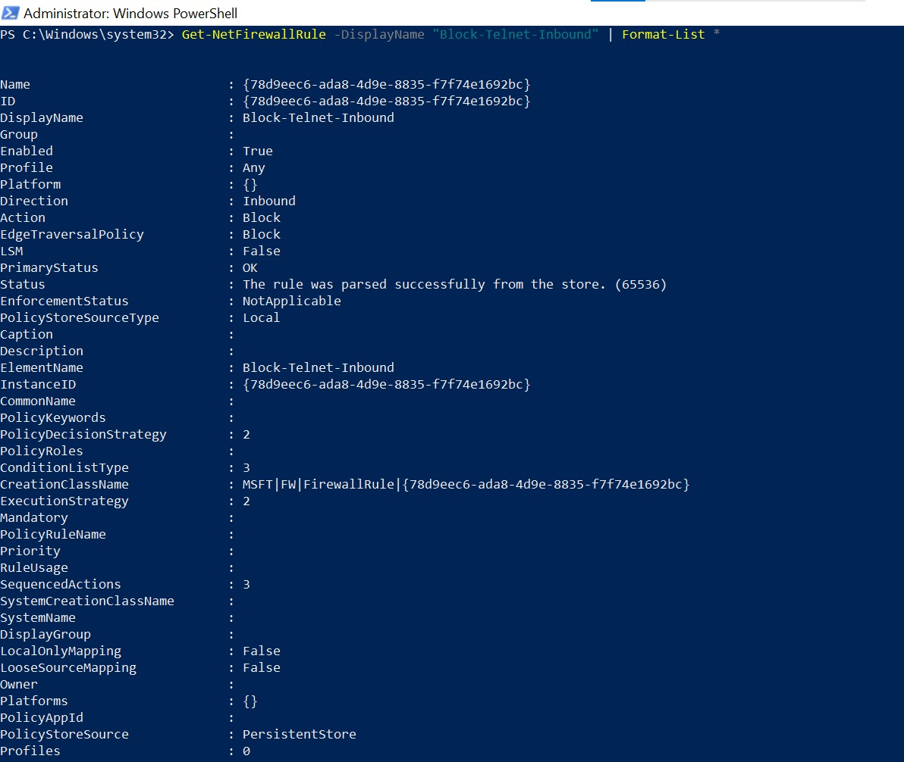

# Telnet Block Firewall Rule Demonstration

## Overview
This project demonstrates how to create, test, and remove a Windows Firewall rule to block inbound Telnet traffic (port 23) using PowerShell and `netsh` commands.

---

## Steps Performed

### 1. View Firewall Rules Before Creation
We start by exporting and viewing the current inbound firewall rules to confirm there is no Telnet block rule.

**Command:**
```powershell
netsh advfirewall firewall show rule name=all dir=in > BeforeRules.txt
```

📸 **Screenshot:**  


---

### 2. Create Telnet Block Rule
Create a new inbound firewall rule named **"Block-Telnet-Inbound"** to block TCP traffic on port 23.

**Command:**
```powershell
New-NetFirewallRule -DisplayName "Block-Telnet-Inbound" -Direction Inbound -LocalPort 23 -Protocol TCP -Action Block
```

📸 **Screenshot:**  


---

### 3. View Created Rule Details
Check the details of the newly created Telnet block rule.

**Command:**
```powershell
Get-NetFirewallRule -DisplayName "Block-Telnet-Inbound" | Get-NetFirewallPortFilter
```

📸 **Screenshot:**  


---

### 4. Filter and Confirm Rule Exists
Filter firewall rules to confirm the Telnet block rule is present.

**Command:**
```powershell
Get-NetFirewallRule | Where-Object {$_.DisplayName -like "*Telnet*"}
```

📸 **Screenshot:**  


---

### 5. Test Telnet Block
Attempt to connect to port 23 to confirm the block is working.

**Command:**
```powershell
Test-NetConnection -ComputerName 127.0.0.1 -Port 23
```

📸 **Screenshot:**  


---

### 6. Remove Telnet Block Rule
Remove the Telnet block rule using PowerShell and verify with `netsh`.

**Commands:**
```powershell
Remove-NetFirewallRule -DisplayName "Block-Telnet-Inbound"
netsh advfirewall firewall delete rule name="Block-Telnet-Inbound"
```

📸 **Screenshot:**  


---

### 7. View Firewall Rules After Deletion
Export and view inbound firewall rules again to confirm the rule is deleted.

**Command:**
```powershell
netsh advfirewall firewall show rule name=all dir=in > AfterRules.txt
```

📸 **Screenshot:**  


---

## Repository Structure
```
📂 Telnet-Firewall-Demo
 ├── 📂 Screenshots
 │    ├── 01_Before_Firewall_Rules_Export.jpg
 │    ├── 02_Create_Telnet_Block_Rule.jpg
 │    ├── 03_View_Created_Rule_Details.jpg
 │    ├── 04_Filter_Telnet_Rule.jpg
 │    ├── 05_Test_Telnet_Block.jpg
 │    ├── 06_Remove_Telnet_Block_Rule.jpg
 │    └── 07_After_Firewall_Rules_Export.jpg
 ├── README.md
 └── commands.txt
```

---

## Conclusion
We successfully:
- Checked initial firewall rules
- Created a Telnet block rule
- Verified it was applied
- Tested the block functionality
- Removed the rule and confirmed deletion

This process is useful for network security testing, auditing, and demonstrating firewall rule configuration.

